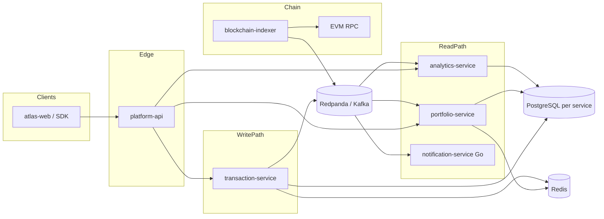

# Atlas Architecture

Architecture source of truth for **Atlas**, a digital asset operations
platform built inside **0xMiller Labs**, a personal engineering lab
([github.com/0xmmiller](https://github.com/0xmmiller)).

0xMiller Labs is a **personal engineering lab**, not a company and not an
employer. Atlas is a public system-design showcase: a real, runnable
service split with documented trade-offs. It does not custody funds and
is not a financial product.

```
Mark Miller
  `- 0xMiller Labs          personal engineering lab
       |- Atlas             distributed asset operations platform
       |- PyScale           Python backend performance lab
       |- ChainKit          Web3 infrastructure toolkit
       `- AgentKit          production-shaped agent backend
```

## Why this repository exists

Code shows that something runs. This repo shows **why it is shaped this
way**. Every service in Atlas exists for a reason that is written down
here, including the options that were rejected.

If you are reviewing this for a hiring loop: start with the ADRs, then
the failure scenarios, then the service READMEs.

## System at a glance



Atlas is six services. The sixth is Go because fan-out is a different
problem than FastAPI domain work ([ADR-007](adr/007-go-notification-plane.md)).

| Service | Exists because | Does not do |
| --- | --- | --- |
| [platform-api](https://github.com/0xmmiller/platform-api) | One external contract, auth, rate limits, correlation IDs | Business writes or chain I/O |
| [transaction-service](https://github.com/0xmmiller/transaction-service) | Intent lifecycle + exactly-once *effects* | Signing keys or portfolio math |
| [blockchain-indexer](https://github.com/0xmmiller/blockchain-indexer) | Canonical chain facts, including reorgs | Serving API queries |
| [portfolio-service](https://github.com/0xmmiller/portfolio-service) | Low-latency read models for positions | Re-scanning logs |
| [analytics-service](https://github.com/0xmmiller/analytics-service) | Heavy historical aggregations | Hot path for wallets |
| [notification-service](https://github.com/0xmmiller/notification-service) | SSE/webhook fan-out from bus facts | Owning intent or position state |
| [atlas-web](https://github.com/0xmmiller/atlas-web) | Operator UI on platform-api | Talking to internals |

Supporting repos: [infrastructure](https://github.com/0xmmiller/infrastructure),
[sdk-python](https://github.com/0xmmiller/sdk-python).

## Document map

| Path | What you get |
| --- | --- |
| [diagrams/](diagrams/) | C4 context, containers, transaction flow |
| [adr/](adr/) | Architecture Decision Records |
| [docs/events.md](docs/events.md) | Event contracts between services |
| [docs/scaling.md](docs/scaling.md) | What scales independently, and what does not |
| [docs/security.md](docs/security.md) | Threat model for a non-custodial ops platform |
| [docs/failure-scenarios.md](docs/failure-scenarios.md) | Reorgs, broker loss, RPC brownout, poison messages |

## Decisions (read these)

1. [ADR-001 Message broker](adr/001-message-broker.md) - Kafka/Redpanda, not NATS, not HTTP chaining
2. [ADR-002 Database per service](adr/002-database-per-service.md) - isolation over a shared schema
3. [ADR-003 Idempotency](adr/003-idempotency.md) - DB uniqueness is the source of truth
4. [ADR-004 Event-driven architecture](adr/004-event-driven-architecture.md) - facts vs commands
5. [ADR-005 Observability](adr/005-observability.md) - traces over more dashboards
7. [ADR-007 Go notification plane](adr/007-go-notification-plane.md) - fan-out in Go, domain in Python
8. [ADR-008 Local model runtime](adr/008-local-model-runtime.md) - Ollama/vLLM first, vendor optional

## Run it

Local stack lives in `infrastructure`. From that repo:

```bash
docker compose up --build
```

This architecture repo has no runtime. It is the design record.

## Explicit non-goals

- Not a hedge fund, exchange, or wallet custodian
- Not 25 services to look "distributed"
- Not a fake multi-year git history
- Not an employer brand. If it looks like a startup, the README failed.
