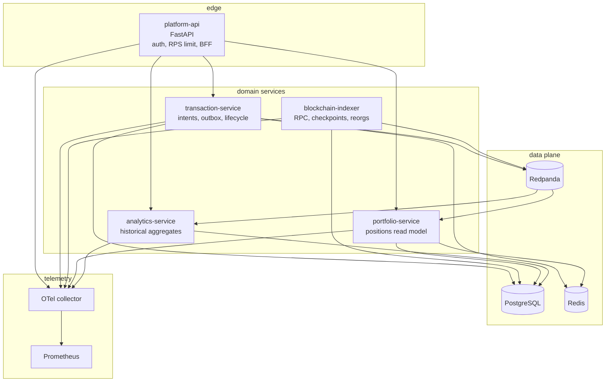

# Containers

Five runtime services, one broker, Postgres (logical DBs), Redis,
and an OTel collector. Notification-service is intentionally absent:
nothing currently needs a second consumer enough to justify a sixth
process. When it does, it subscribes to existing topics.

## Why these cuts

- **platform-api vs transaction-service:** public contract vs write-side
  invariants. The API can be rewritten (GraphQL, later) without
  touching idempotency.
- **indexer vs portfolio:** ingestion is CPU/RPC bound and must
  rewind. Portfolio is query-bound and cached. Different saturation
  profiles (see `docs/scaling.md`).
- **analytics vs portfolio:** a 90-day timeseries query must not
  share a connection pool with `GET /positions`.
