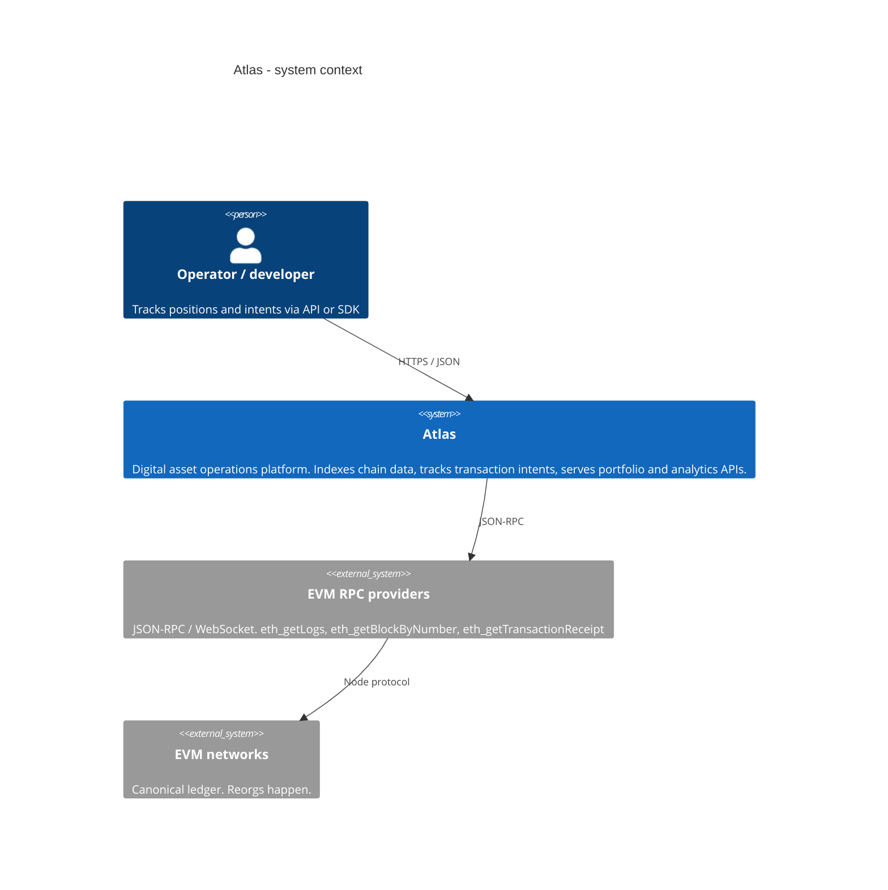

# System context

Atlas sits between a user (or a developer with the SDK) and public
EVM networks. 0xMiller Labs does not operate a custodian. Signing, if
any, is out of process - the platform tracks intents and on-chain
facts.

Trust boundary: Atlas **believes the indexer**, not a client's idea
of their balance. Clients may lie; the chain (after reorg handling)
does not.
