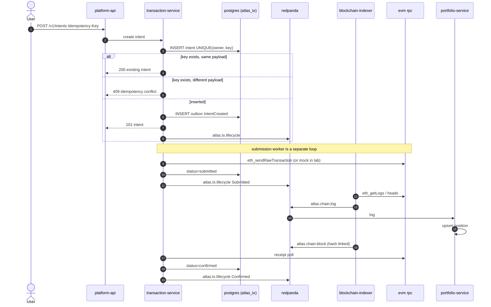
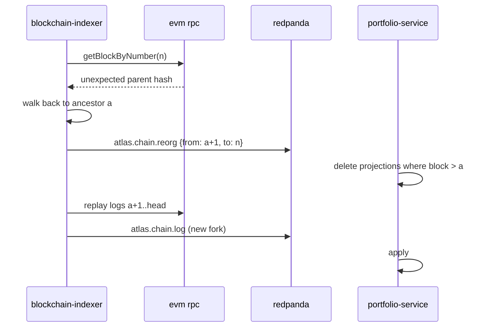

# Transaction flow

Happy path for an intent that later shows up as a confirmed on-chain
transaction and a portfolio mutation.

```mermaid
sequenceDiagram
  autonumber
  actor User
  participant API as platform-api
  participant TX as transaction-service
  participant PG as postgres (atlas_tx)
  participant Bus as redpanda
  participant IDX as blockchain-indexer
  participant RPC as evm rpc
  participant PORT as portfolio-service

  User->>API: POST /v1/intents  Idempotency-Key
  API->>TX: create intent
  TX->>PG: INSERT intent UNIQUE(owner, key)
  alt key exists, same payload
    TX-->>API: 200 existing intent
  else key exists, different payload
    TX-->>API: 409 idempotency conflict
  else inserted
    TX->>PG: INSERT outbox IntentCreated
    TX-->>API: 201 intent
    TX->>Bus: atlas.tx.lifecycle
  end

  Note over TX,RPC: submission worker is a separate loop
  TX->>RPC: eth_sendRawTransaction (or mock in lab)
  TX->>PG: status=submitted
  TX->>Bus: atlas.tx.lifecycle Submitted

  IDX->>RPC: eth_getLogs / heads
  IDX->>Bus: atlas.chain.log
  Bus->>PORT: log
  PORT->>PORT: upsert position
  IDX->>Bus: atlas.chain.block (hash linked)
  TX->>RPC: receipt poll
  TX->>PG: status=confirmed
  TX->>Bus: atlas.tx.lifecycle Confirmed
```

Reorg path is the more important diagram:

```mermaid
sequenceDiagram
  participant IDX as blockchain-indexer
  participant RPC as evm rpc
  participant Bus as redpanda
  participant PORT as portfolio-service

  IDX->>RPC: getBlockByNumber(n)
  RPC-->>IDX: unexpected parent hash
  IDX->>IDX: walk back to ancestor a
  IDX->>Bus: atlas.chain.reorg {from: a+1, to: n}
  PORT->>PORT: delete projections where block > a
  IDX->>RPC: replay logs a+1..head
  IDX->>Bus: atlas.chain.log (new fork)
  PORT->>PORT: apply
```
